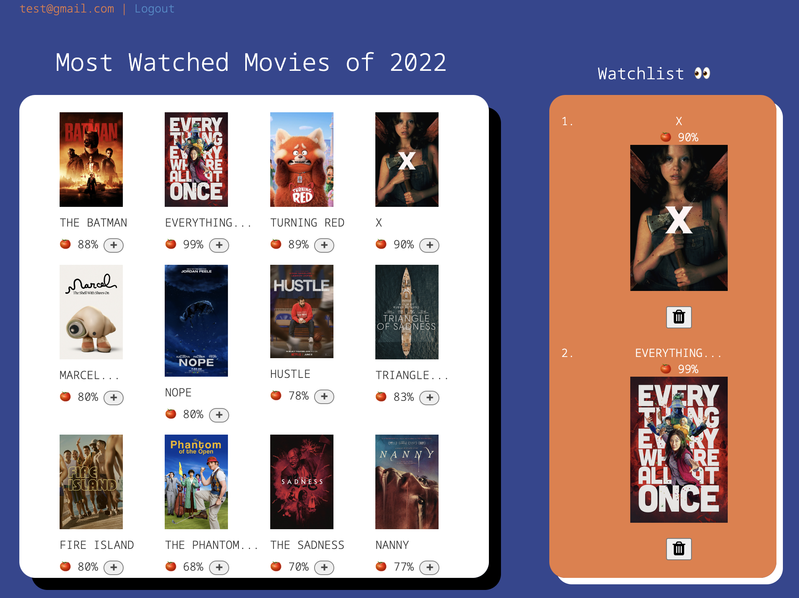

## MyReel
Full-stack web application that provides users with a platform to discover new movies, save their favorite movies to a personalized watchlist, and rate movies that they have seen. 

## Technologies Used
HTML/CSS, JavaScript, Node.js/Express, MongoDB, and Passport Login.

## What I learned
I learned how to effectively use front-end and back-end technologies together to create a comprehensive app that provided users with a wide range of useful features while still maintaining a streamlined and intuitive UI.

## Results
By building the app with scalability in mind, I was able to ensure that it could easily handle a growing user base and that new features and functionality could be added in the future without major disruptions to the app's core infrastructure

## Installation

1. Clone repo
2. run `npm install`

## Usage

1. run `node server.js`
2. Navigate to `localhost:8080`
